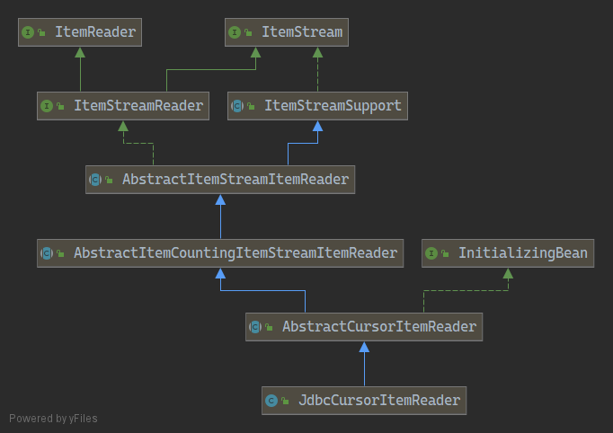

# ItemReader 의 cursor vs paging 차이점
## cursor
* JDBC ResultSet 으로 select 쿼리에 대한 결과값을 반환받는다.
* ResultSet 은 현재 로우에 커서를 유지시킨다.
* ResultSet 은 next() 를 호출하면서 커서는 다음 로우를 가리킨다.
* spring-batch 기반의 ItemReader 구현체는 초기화 시에 커서를 열고, read 를 호출할 때마다 커서를 다음 한 행씩 이동시키면서 매핑된 객체에 반환한다.

## JdbcCursorItemReader 구현 및 상속 구조

 