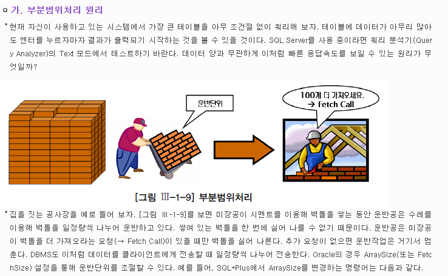
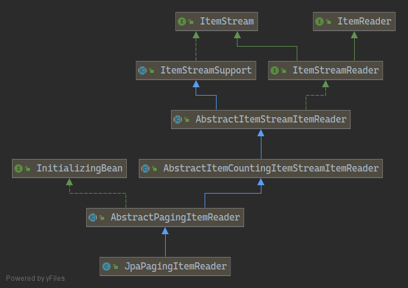

# ItemReader 의 cursor vs paging 차이점

## cursor 🍁
* JDBC ResultSet 으로 select 쿼리에 대한 결과값을 반환받는다.
* ResultSet 은 현재 로우에 커서를 유지시킨다.
* ResultSet 은 next() 를 호출하면서 커서는 다음 로우를 가리킨다.

### JdbcCursorItemReader 구현 및 상속 구조


* `JdbcCursorItemReader` 는 사용하려고 한다.

### FetchCall 


### code sample
```java
/**
 * 커서단위로 읽어들이고, 해당 정크사이즈만큼 writer 에서 하도록 한다.
 * @return
 */
@Bean
public JdbcCursorItemReader<Store> deleteJobReader() {
    return new JdbcCursorItemReaderBuilder<Store>()
            .dataSource(dataSource)
            .name("storeItemReader")
            .sql("SELECT id, no, name, address, phone_number FROM store WHERE no >= 50")
            .rowMapper(new RowMapper<Store>(){
                @Override
                public Store mapRow(ResultSet rs, int rowNum) throws SQLException {
                    Store store = Store.builder()
                            .no(rs.getLong("no"))
                            .name(rs.getString("name"))
                            .address(rs.getString("address"))
                            .phoneNumber(rs.getString("phone_number"))
                            .build();
                    store.updateId(rs.getLong("id"));
                    return store;
                }
            })
            .fetchSize(CHUNK_SIZE)          // 데이터베이스에서 call 수행 시 반환 갯수 힌트 값
            .driverSupportsAbsolute(true)   // jdbc 드라이버가 ResultSet 의 강제이동을 지원하는지 여부, 대규모의 데이터 셋의 경우에 성능 향상을 위해 true 가 좋음.
            .build();
}
```
* spring-batch 기반의 ItemReader 구현체는 초기화 시에 커서를 열고, read 를 호출할 때마다 커서를 다음 한 행씩 이동시키면서 매핑된 객체에 반환한다.
* `JdbcCursorItemReader` 에서 openCursor() 를 수행한다.
* `AbstractCursorItemReader` 에서 `PreparedStatement` 에 대해서 `setFetchSize()` 를 조정한다.
    * 해당 값은 fetchSize 로 설정한 값만큼 할당된다.
    * 결국 SELECT 쿼리 시에 매번 PreparedStatement 가 fetchCall 을 수행하는 형태이다.
* `AbstractCursorItemReader` 에서 `doRead()` 를 수행한다.
* `JdbcCursorItemReader` 에서 `readCursor()` 를 수행한다.
* 반환된 row 를 rowMapper 메소드를 통해서 제네릭 타입으로 반환한다.
    * 위의 코드에선 오버라이딩을 해서 `Store` 객체로 rowMapping 수행을 하였다.
* doRead 및 readCursor 의 과정을 반복하다가 `마지막에 close()` 를 수행한다.

## paging 🍁
* 결과의 일부만 가져오는 쿼리를 여러번 실행하는 것이다.
    * 결과의 일부는 페이지(paging) 이라고 칭한다.
* 각 쿼리로 `rownum` 과 `count` 가 명시되어야 한다.
* ex) `SELECT * FROM store LIMIT {rownum}, {count};`
    * `SELECT * FROM store LIMIT 0, 5;` : 0번째부터 5개 들고온다.
    * `SELECT * FROM store LIMIT 5, 5;` : 5번째부터 5개 들고온다.

### JpaPagingItemReader 구현 및 상속 구조


### code sample
```java
@Bean
public JpaPagingItemReader<Store> deleteJobReader() {
    return new JpaPagingItemReaderBuilder<Store>()
            .name("storeItemReader")
            .entityManagerFactory(entityManagerFactory)
            .pageSize(CHUNK_SIZE)                                   // 조회개수
            .queryString("SELECT item FROM Store item")             // 조건절 설정
            .build();
}

// AbstractPagingItemReader.class 부분
@Nullable
	@Override
	protected T doRead() throws Exception {

		synchronized (lock) {

			if (results == null || current >= pageSize) {

				if (logger.isDebugEnabled()) {
					logger.debug("Reading page " + getPage());
				}

				doReadPage();
				page++;
				if (current >= pageSize) {
					current = 0;
				}

			}

			int next = current++;
			if (next < results.size()) {
				return results.get(next);
			}
			else {
				return null;
			}

		}

	}
```
* rownum 이 상태가 유지되기 때문에 만약 데이터 로우에 대한 컬럼 업데이트가 아닌 삭제로 처리하는 경우에 일부 데이터는 삭제되지 않는다.
* rownum 은 증가하고 count 는 증가되는데, 매번 쿼리로 select 문을 날릴때마다 데이터는 삭제되어서 갯수가 다시 갱신되기 때문이다.
    


 