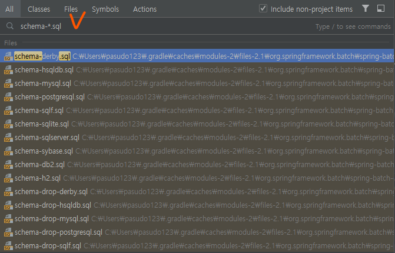
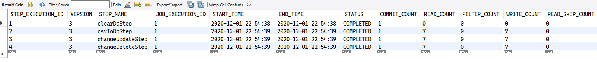

# batch meta data table


* 자바의 `Domain` 객체와 유사하다.
    * `JobInstance` :: `BATCH_JOB_INSTANCE` Table
    * `JobExecution` :: `BATCH_JOB_EXECUTION` Table
    * `JobParameters` :: `BATCH_JOB_EXECUTION_PARAMS` Table
    * `StepExecution` :: `BATCH_STEP_EXECUTION` Table
* 각각의 `ExecutionContext` 는 `BATCH_JOB_EXECUTION_CONTEXT` 및 `BATCH_STEP_EXECUTION_CONTEXT` 에 매핑된다.
* `JobRepository` 가 자바 객체들을 각각의 테이블에 맞게 저장을 한다.


* intellij 에서 `schema-*.sql` 을 검색하면 org.springframework.batch.core 에 포함된 sql 파일들을 보여준다.

## PK 전략
* `BATCH_JOB_INSTANCE` 의 `PK` 는 `JOB_INSTANCE_ID` 인데, 해당 값은 auto_increment 가 아닌 `별도의 시퀀스`로 생성된다. 
    * `BATCH_JOB_EXECUTION_SEQ` 의 `ID field` 값과 매핑된다.
```
# batch_job_execution
SELECT * FROM batch_job_execution;

SELECT * FROM batch_job_execution_seq;
```

<BR>

* `BATCH_JOB_EXECUTION` 의 `PK` 도 마찬가지이다.
```
SELECT * FROM batch_job_execution;

SELECT * FROM batch_job_execution_seq;

```

<BR>

* `BATCH_STEP_EXECUTION` 의 `PK` 도 마찬가지이다.
* batch_step_execution 의 데이터를 살펴보면, 배치의 step 을 실행한 순서대로 값이 들어가있다.
```
# batch_step_execution
SELECT * FROM batch_step_execution;

SELECT * FROM batch_step_execution_seq;
```



### java 코드단에서 memberJob 에 대한 step 을 작성한 상태.
```java
@Bean
@Qualifier("memberJob")
public Job memberJob() {
    return jobBuilderFactory.get("memberJob")
            .listener(new MemberJobListener())
            .start(clearDbStep())
            .next(csvToDbStep())

            /** changeUpdateStep() 을 수행하고, 종료코드가 COMPLETED 면 changeDeleteStep() 로 이동 **/
            .next(changeUpdateStep())
                .on("COMPLETED").to(changeDeleteStep())

            /** changeUpdateStep() 을 수행하고, 종료코드가 FAILED 면 changeUpdateFailedStep() 로 이동 **/
            .from(changeUpdateStep())
                .on("FAILED").to(changeUpdateFailedStep())

            .end()
            .build();
}
```

## reference
* https://ahndy84.tistory.com/24